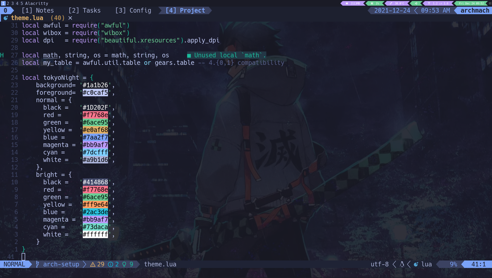

### Tools - Neovim | Arch | Tmux | Alacritty

## Work & Side Projects - Angular | Lua 
- 🔭 I’m currently working on
  - Angular applications at [Cisco](https://www.cisco.com/c/m/en_us/customer-experience/index.html)
  - [Nvim Quick Switcher](https://github.com/Everduin94/nvim-quick-switcher) written in Lua
  - Rewriting [Yami Flashcards](https://yami-flashcards.dev/)
- 🌳 I used to work on
  - Fullstack Angular / Springboot
  - Utility / Telecom GIS Applications
- 🌱 I’m currently learning Lua
- 📫 How to reach me: ...
- ⚡ Fun fact, I am a brown belt in Brazilian Jiu Jitsu
