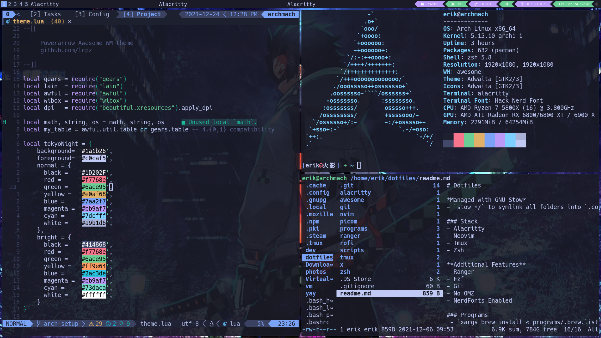

# Hello There 👋 

- 🔭 I’m currently working on
  - Angular apps at [Cisco](https://www.cisco.com/c/m/en_us/customer-experience/index.html)
  - [Flotes](https://flotes.app)
  - [Better Commits](https://github.com/Everduin94/better-commits)
  - [Nvim Quick Switcher](https://github.com/Everduin94/nvim-quick-switcher)
- 🌳 I used to work on
  - Utility GIS Applications
  - Angular articles [Medium](https://erxk.medium.com/)
- 🌱 I’m currently learning: Svelte, Postgres, ZOD
- 📫 How to contact me: Socials at the bottom
- ⚡ Fun fact: I am a black belt in Brazilian Jiu Jitsu

<h3 align="center">

Setup 

</h3>

<h3 align="center">
Projects
</h3>

<h3 align="center">
  

  

 

 

</h3>

Web Application / PWA - Markdown Notetaking with Flashcard Features 

<h3 align="center">

</h3>

A CLI for writing better commits, following the conventional commit guidelines	

https://user-images.githubusercontent.com/14320878/225088948-43073a0e-400c-4c5f-a6e3-4f4961cfe43d.mov

<h3 align="center">

</h3>

<h3 align="center">

Socials 

</h3>

<!--
### Setup 2022 and Before

-->
